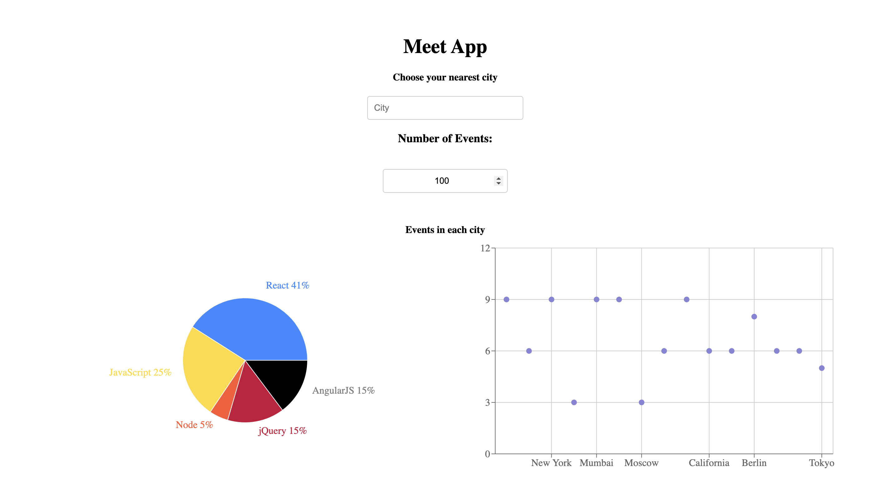
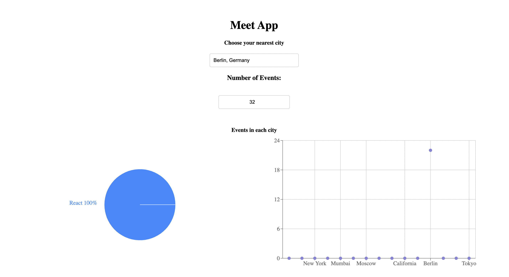
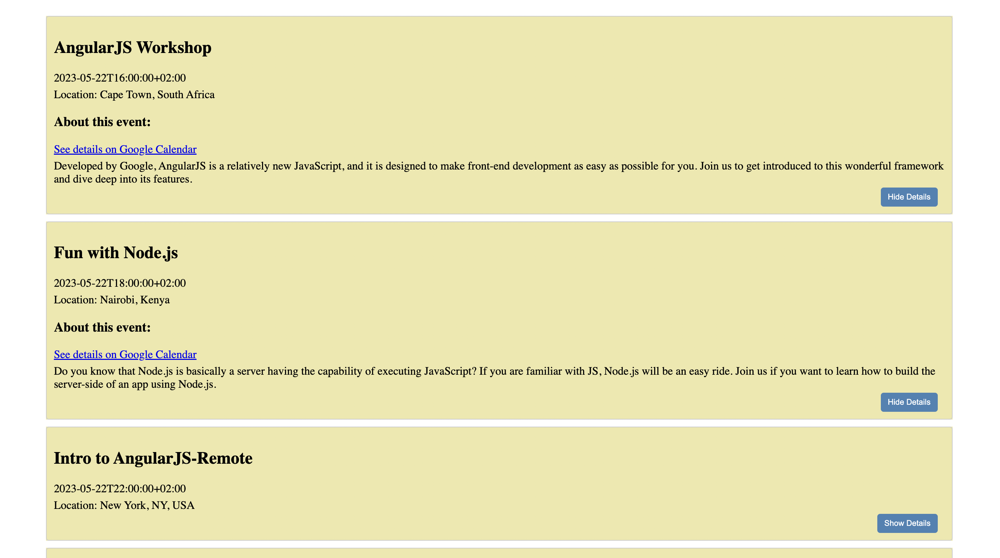

# Meet App
This is a serverless, progressive web application (PWA) with React using a test-driven development (TDD) technique. The application is using the Google Calendar API to fetch upcoming full-stack meetup events.

This site was built using <strong>Github Pages</strong>.

<br>

<strong>[LIVE DEMO](https://koola123.github.io/meet/)</strong>





# 🎯 Technology stack:

- Serverless functions (AWS lambda) for the authorization server instead of using a traditional server.
- OAuth2 Log-in function with Google account
- TDD Unit and Integration tests written with Jest
- BDD style User Acceptance tests written with Jest-Cucumber
- End-to-End tests written with Puppeteer
- Data visualization with Recharts
- Progressive Web Application


# Application Features:


## Feature 1: Filter events by city
- As a user, I would like to be able to filter events by city so that I can see the list of events that take place in that city.
#### Scenario 1: When user hasn’t searched for a city, show upcoming events from all cities.
#### Scenario 2: User should see a list of suggestions when they search for a city.
#### Scenario 3: User can select a city from the suggested list.


## Feature 2: Show/hide event details.
- As a user, I would like to be able to show/hide event details so that I can see more/less information about an event.
#### Scenario 1: An event element is collapsed by default
#### Scenario 2: User can expand an event to see its details
#### Scenario 3: User can collapse an event to hide its details


## Feature 3: Specify number of events.
- As a user, I would like to be able to specify the number of events I want to view in the app so
that I can see more or fewer events in the events list at once.
#### Scenario 1: When user hasn’t specified a number, 32 is the default number
#### Scenario 2: User can change the number of events they want to see


## Feature 4: Use the app when offline.
- As a user, I would like to be able to use the app when offline so that I can see the events I
viewed the last time I was online.
#### Scenario 1: Show cached data when there’s no internet connection
#### Scenario 2: Show error when user changes the settings (city, time range)


## Feature 5: View a chart showing the number of upcoming events by city.
- As a user, I would like to be able to see a chart showing the upcoming events in each city so
that I know what events are organized in which city.
#### Scenario 1: Show a chart with the number of upcoming events in each city

<br>

# 🛠 Installation:

#### Prerequisites / Getting started

```
git clone https://github.com/koola123/meet.git
cd meet
npm install
npm run start
```

<strong> ⚠️ Don't forget to also install nodejs LTS or the latest version!</strong>


<br>

Version 1.0.0

